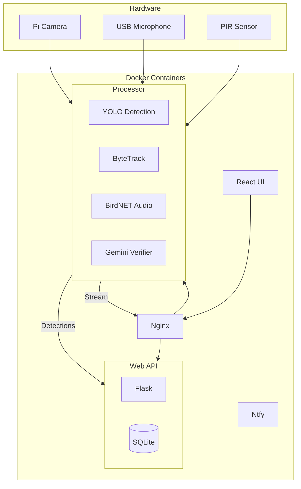

# BirdLense Application

## Raspberry Pi Setup

Use [Raspberry Pi Imager](https://www.raspberrypi.com/software/) to flash **Raspberry Pi OS Lite (64-bit)**:

- Set hostname: `birdlense`
- Enable SSH with password or key
- Configure WiFi and timezone

## Quick Start

1. **SSH into Raspberry Pi**

   ```bash
   ssh user@birdlense.local
   ```

2. **Clone and install:**

   ```bash
   sudo apt install git && git clone https://github.com/AleksandrRogachev94/BirdLense
   cd BirdLense/app
   chmod +x install.sh && ./install.sh
   ```

   Restart terminal session to apply permission changes.

3. **Start the application:**

   ```bash
   cd BirdLense/app
   make start
   ```

   Web interface available at `http://birdlense.local`. View logs with `make logs`.

## Configuration

### Domain Configuration

By default, BirdLense uses `birdlense.local` as the domain. To use a different domain (e.g., `birdlens.toddlab.cloud`):

1. **Copy the environment template:**
   ```bash
   cp .env.example .env
   ```

2. **Edit `.env` and set your domain:**
   ```bash
   BIRDLENSE_DOMAIN=birdlens.toddlab.cloud
   NTFY_BASE_URL=http://birdlens.toddlab.cloud:8081
   ```

3. **Restart the application:**
   ```bash
   make stop && make start
   ```

Alternatively, use the pre-configured toddlab environment:
```bash
cp .env.toddlab .env
```

### Application Settings

Visit the **Settings** page first to configure your location (ZIP code), OpenWeather API key, and optionally a Gemini API key for AI features.

## Notifications

Local notifications via bundled ntfy server (nothing shared outside your network):

1. Install ntfy app: [Android](https://play.google.com/store/apps/details?id=io.heckel.ntfy) | [iOS](https://apps.apple.com/app/ntfy/id1625396347)
2. Add server: `http://your-domain:8081` (e.g., `http://birdlense.local:8081` or `http://birdlens.toddlab.cloud:8081`), channel: `birdlense`

## Development

### Docker Commands

```bash
make build-dev    # Build development containers
make start-dev    # Start development mode
make stop-dev     # Stop containers
make logs         # View logs
```

### Project Structure

```
app/
├── app_config/     # YAML configuration files
├── data/           # Recordings, samples, LLM logs
├── processor/      # Video/audio processing (Python)
├── web/            # Flask API backend
├── ui/             # React frontend (Vite + MUI)
└── nginx/          # Reverse proxy configuration
```

## Architecture



## Components

| Container     | Purpose                                                                                                                        |
| ------------- | ------------------------------------------------------------------------------------------------------------------------------ |
| **Processor** | Captures video, runs YOLO detection with ByteTrack tracking, processes audio with BirdNET, optionally verifies with Gemini LLM |
| **Web**       | Flask API, SQLite database, visit analytics, daily AI summaries                                                                |
| **UI**        | React + Material UI, video playback with track overlays, timeline, species stats                                               |
| **Nginx**     | Reverse proxy, static file serving, MJPEG stream routing                                                                       |
| **Ntfy**      | Local push notifications                                                                                                       |

## Detection Pipeline

1. **Motion trigger** → PIR sensor or continuous mode
2. **Binary detection** → Fast YOLO model detects any bird
3. **Object tracking** → ByteTrack assigns stable IDs across frames
4. **Species classification** → Classifier model identifies species
5. **Blur filtering** → Rejects blurry frames for classification
6. **LLM verification** → Optional Gemini check for low-confidence detections
7. **Audio processing** → BirdNET identifies species from audio

## MCP Integration

For AI agent integration (e.g., Claude Desktop):

1. Download `web/birdlense_mcp.py`
2. Reference in your `claude_desktop_config.json`
3. See [MCP docs](https://modelcontextprotocol.io/quickstart/server)

## FAQ

**Camera not recognized?**

Adjust `/boot/firmware/config.txt`. Example for PiCam v2 on Pi 5:

```
dtoverlay=imx219,cam0
camera_auto_detect=0
```

Then reboot.

## Hardware Wiring (Raspberry Pi 4B)

### PIR Motion Sensor

| PIR Pin | Pi Pin         | Description |
| ------- | -------------- | ----------- |
| VCC     | Pin 2          | 5V Power    |
| OUT     | Pin 7 (GPIO 4) | Signal      |
| GND     | Pin 6          | Ground      |

### Cooling Fan

Connect directly to 5V power for continuous cooling:

| Fan Wire  | Pi Pin | Description |
| --------- | ------ | ----------- |
| Red (+)   | Pin 4  | 5V Power    |
| Black (-) | Pin 6  | Ground      |

> [!TIP]
> Small fans draw minimal power (~0.1W) and continuous cooling improves Pi longevity during 24/7 operation.
